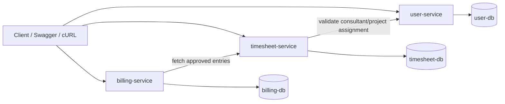

# Architecture

## Service Responsibilities

### User Service

Owns:

- user authentication and JWT issuance
- internal users and roles
- consultants
- clients
- projects
- project assignments
- user and assignment audit trail

### Timesheet Service

Owns:

- time entries
- draft, submit, approve, reject state transitions
- timesheet reporting
- timesheet audit records
- immutable reference snapshots required for downstream billing

### Billing Service

Owns:

- billing periods
- invoice-ready billing summaries
- billing aggregation logic
- billing audit events

## Communication Flow

## Data Ownership

- `user-service` is the source of truth for users, consultants, clients, projects, and assignments.
- `timesheet-service` owns workflow state and stores reference snapshots such as consultant name, project name, client name, and hourly rate at entry creation/update time.
- `billing-service` owns billing periods and persisted summary lines, using approved time snapshots as invoice inputs.

This keeps data ownership explicit while avoiding cross-service joins at query time.

## Authentication Overview

- Login happens through `user-service` at `/api/v1/auth/login`.
- Successful login returns a signed JWT containing:
  - `sub` = user id
  - `email`
  - `role`
  - `consultantId` when the user is a consultant
- `timesheet-service` and `billing-service` validate the token locally using the shared `JWT_SECRET`.
- Internal service-to-service calls use `X-Internal-Api-Key`.

## Workflow Design

### Assignment Validation

Before a time entry is created or updated, `timesheet-service` calls:

- `GET /internal/v1/assignments/validate` on `user-service`

This ensures:

- the consultant exists
- the project exists
- the consultant has an active assignment for that project and date
- timesheet data is grounded in assignment reality

### Timesheet State Machine

Allowed transitions:

- `DRAFT -> SUBMITTED`
- `REJECTED -> SUBMITTED`
- `SUBMITTED -> APPROVED`
- `SUBMITTED -> REJECTED`

Rejected or draft entries may be edited. Submitted or approved entries may not be edited.

### Billing Generation

`billing-service` calls:

- `GET /internal/v1/time-entries/approved` on `timesheet-service`

It groups approved billable entries by:

- client
- project
- consultant
- selected date range

It then persists:

- one `BillingPeriod`
- one or more `BillingSummary` lines

## Tradeoffs

- No distributed transactions: chosen deliberately to keep the implementation realistic and explainable for interview discussion.
- Synchronous service calls over Feign: appropriate for a compact three-service system and easy to evolve toward events later.
- Snapshot storage in `timesheet-service` and `billing-service`: favors financial stability and auditability over perfect normalization.
- Separate services and databases without a gateway: keeps the architecture clearly microservice-based without introducing avoidable operational noise.
